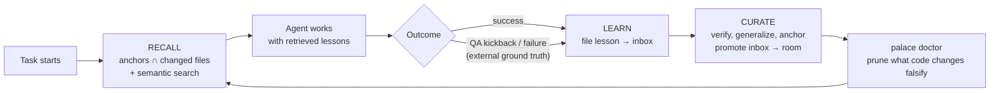

# Memento

> *Your agent wakes up with amnesia every session. Memento is its system of tattoos.*

In Christopher Nolan's *Memento*, Leonard can't form new memories. Every morning he wakes up blank. So he stops trusting his brain and builds an **external memory architecture**: tattoos for the facts that must never be lost, annotated polaroids for the people and places, notes for everything else. He doesn't remember — he *retrieves*.

An LLM agent between sessions is Leonard. Every conversation starts blank. Every lesson learned — the API that silently truncates, the test pattern that got a PR kicked back, the approach that finally worked — evaporates when the context window closes. The next session steps on the same rake.

**Memento is a learning architecture for AI agents**: lessons are captured from *real outcomes*, filed into a structured memory palace, and retrieved *by context* exactly when the agent is about to need them — at zero token cost for the search itself.

---

## Why not just keep adding rules to a prompt?

Because that's how most teams do it today, and it fails in a predictable way:

1. A bug ships → someone appends a rule to the review prompt / skill / CLAUDE.md.
2. The prompt grows. Every rule loads on every run, relevant or not.
3. Adherence degrades — a model juggling 90 "non-negotiable" rules follows each one worse than a model holding 15.
4. Nothing is ever pruned, because nothing measures whether a rule still earns its place.

Accumulation without curation isn't learning. It's hoarding.

## The idea: ACE

Memento implements the core insight of **ACE — Agentic Context Engineering** ([Zhang et al., Stanford & SambaNova Systems, 2025](https://arxiv.org/abs/2510.04618)): treat context not as a monolithic prompt you rewrite, but as an **evolving playbook of itemized lessons**, updated by incremental deltas.

ACE identifies the two failure modes Memento is built to avoid:

- **Context collapse** — when an LLM rewrites its accumulated context wholesale, it compresses and silently drops detail.
- **Brevity bias** — iterative refinement drifts toward short, generic advice ("be careful with types") and away from the specific, actionable knowledge that actually prevents bugs.

ACE's answer is a three-role loop — **Generator** (does the work), **Reflector** (extracts lessons from outcomes), **Curator** (merges them as itemized deltas). Memento maps that loop onto concrete, boring, reliable infrastructure.

## The storage: a memory palace, not a JSON blob

The reference ACE-style implementations store lessons in a single playbook file and select the top-N by a global helpfulness score. That breaks down fast:

| Single scored playbook | Memento |
|---|---|
| Flat namespace — all lessons compete for the same top-N slots by *historical* score | **Location is relevance** — lessons live where the concept lives (wing → room → drawer) and are retrieved by *context* |
| Useful-in-general beats useful-*right-now* | Lessons anchored to the files you're touching surface first |
| One mutable JSON: race conditions, unmergeable in git | Markdown files in-repo are the source of truth; the index is derived and rebuildable. PRs, merges and reviews just work |
| Staleness handled by counters (or not at all) | **Falsifiability**: every lesson is anchored to real paths; when the code moves, `palace doctor` flags the lesson as suspect |

The palace layer is **[MemPalace](https://github.com/MemPalace/mempalace)** — a local-first memory system with semantic search over locally-computed embeddings (no API key, no per-query LLM cost) — driven through the [`long-horizon`](https://github.com/sychus/long-horizon) `palace` CLI, which adds the per-project `.palace/` structure, write-time validation, anchors, and `doctor`.

```
<your-repo>/
  .palace/
    architecture/   how it's put together
    decisions/      why it's this way, what was rejected
    runbooks/       it's broken at 3am — what do I do
    glossary/       what a word means here
    inbox/          ← raw lessons land HERE — never canonical
    ...
```

## The loop



Three principles make it a system instead of a habit:

1. **Mechanism over discipline.** Recall and capture run from hooks and scripts — not from the model remembering to do it. A learning loop that depends on the learner's memory is a joke that writes itself.
2. **External ground truth over self-report.** The strongest failure signal isn't the agent grading its own work — it's a QA kickback, a `Changes requested`, a reverted commit. Memento's capture entry points are built around those events.
3. **Relevance over competition.** No global top-N. The question is never "what are the 25 best lessons ever" — it's "what did we learn *about the files I'm touching right now*."

## The pieces

| Piece | Role in ACE | What it does |
|---|---|---|
| [`skills/memento-recall`](skills/memento-recall/SKILL.md) | feeds the Generator | Pulls anchored + semantically related lessons at task start. Read-only. |
| [`skills/memento-learn`](skills/memento-learn/SKILL.md) | Reflector | Captures one actionable lesson into `.palace/inbox/`. Never writes to canonical rooms. |
| [`skills/memento-curate`](skills/memento-curate/SKILL.md) | Curator | Gated promotion: verify against code, generalize to the bug *class*, dedupe, anchor, file to a room, prune the superseded. |
| `skills/*/scripts/` | the deterministic substrate | Recall, capture, kickback-ingestion and promotion as plain shell, bundled inside each skill — zero LLM tokens spent on bookkeeping. |
| [`hooks/`](hooks/) | closes the loop | Claude Code hook wiring so recall fires at session start instead of depending on anyone's memory. |
| [`docs/architecture.md`](docs/architecture.md) | the rationale | The precise ACE mapping, the case against single-file playbooks, signal trust ranking, lesson lifecycle. |
| [`skills/palace`](skills/palace/SKILL.md), [`skills/mempalace-setup`](skills/mempalace-setup/SKILL.md) | storage layer | The palace skills Memento builds on, vendored here so the repo is self-contained. |

Note the deliberate authority split — **recall** (read-only) / **learn** (writes only to a staging area) / **curate** (the only path into canonical memory, gated). A lesson can't corrupt the map on its way in; it has to earn promotion.

## Quickstart

```bash
# 0. One-time, per machine: the palace CLI + MemPalace
npm i -g github:sychus/long-horizon
# then follow skills/mempalace-setup/SKILL.md for the Docker image

# 1. In your project
palace init && palace scan && palace sync

# 2. Install the memento skills (Claude Code)
cp -r skills/memento-* ~/.claude/skills/

# 3. Wire the hooks (see hooks/README.md)

# 4. Work. When QA kicks back a ticket:
~/.claude/skills/memento-learn/scripts/kickback.sh <pr-number> "what we learned"
# ... and periodically:
#    /memento-curate      → inbox zero, palace doctor green
```

## What "learning" means here, concretely

A lesson is **actionable and anchored** or it doesn't get in:

- ✅ `POST /attendees silently drops "items" unless it's an array — the 200 lies` *(anchored to the client + the route)*
- ✅ `Tests that flip org-wide settings need a finally-guaranteed restore or they corrupt every parallel worker`
- ❌ `Be careful with types`
- ❌ `Check the schema`

And a lesson **dies** when the code it's anchored to changes (`palace doctor` flags it), when an automated test or lint rule now covers it (curation prunes it), or when review proves it wrong. A map that's 90% right is worse than no map — the wrong 10% is where you get hurt.

## Credits

- **ACE**: Qizheng Zhang, Changran Hu, Shubhangi Upasani, Boyuan Ma, Fenglu Hong, Vamsidhar Kamanuru, Jay Rainton, Chen Wu, Mengmeng Ji, Hanchen Li, Urmish Thakker, James Zou, Kunle Olukotun — [*Agentic Context Engineering: Evolving Contexts for Self-Improving Language Models*](https://arxiv.org/abs/2510.04618), arXiv:2510.04618, 2025. Memento is an independent implementation of the ideas in this paper; all credit for the framework belongs to its authors.
- **[MemPalace](https://github.com/MemPalace/mempalace)** — the local-first memory palace engine Memento stores into. Not our invention either; Memento stands on it.
- **[reshadat/self-learning-claude](https://github.com/reshadat/self-learning-claude)** — prior art that got us thinking; its single-playbook design is the counterexample the storage layer here is a response to.
- *Memento* (2000), dir. Christopher Nolan — for the architecture diagram, basically.

## License

[MIT](LICENSE)
